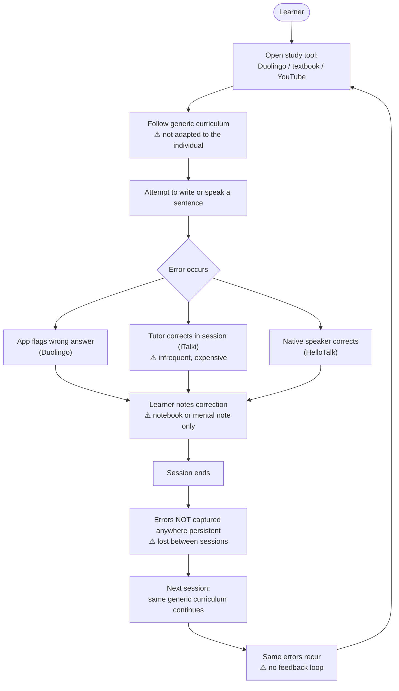
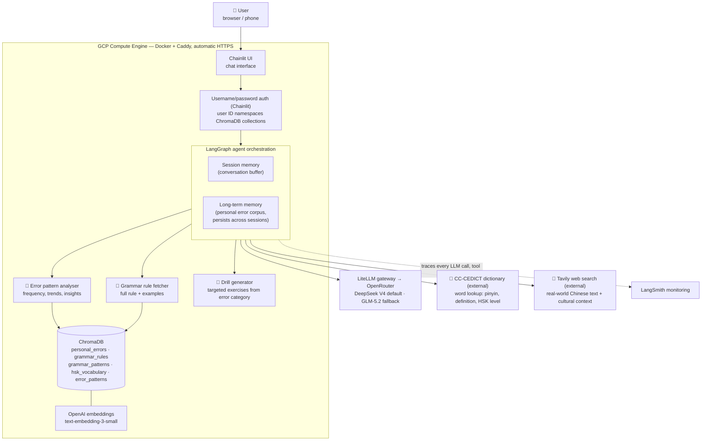
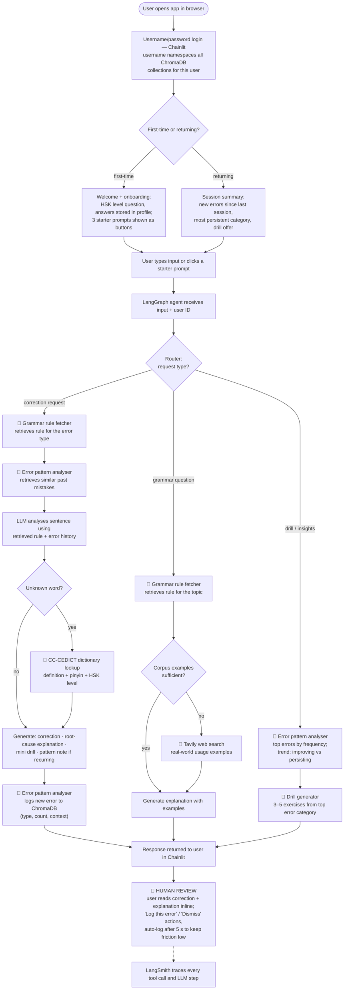
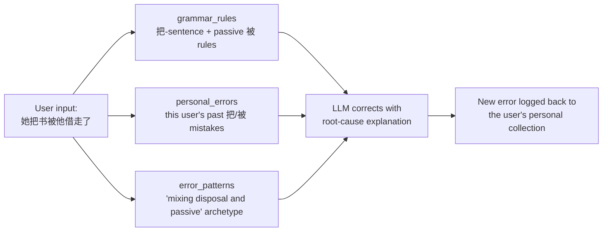

# Mandarin Coach — Certification Challenge

**Student:** Reuben Frith  
**Submission:** Google Form — https://forms.gle/xtM9F38nfRKcdjH97  
**Live app:** https://34-129-227-111.nip.io — deployed end-to-end (auth, agent, persistent per-user corpus)  
**Demo video:** *(link added on submission)*

| Rubric deliverable | Section |
|---|---|
| Problem, one sentence | [Problem statement](#problem-statement) |
| Why it's a problem for this user | [Why this is a problem](#why-this-is-a-problem) |
| How the user solves it today (diagram) | [How learners handle it today](#how-learners-handle-it-today) |
| Evaluation input–output pairs | [Evaluation questions](#evaluation-questions) |
| Solution, one sentence | [Solution statement](#solution-statement) |
| Infrastructure diagram + why each tool | [Infrastructure](#infrastructure) |
| Agent workflow diagram + explanation | [Agent workflow](#agent-workflow) |
| Data sources & external APIs | [Data sources](#data-sources) |
| Default chunking strategy + why | [Chunking strategy](#chunking-strategy) |
| Deployed end-to-end prototype | [Task 4: Prototype](#task-4-prototype) + live app above |
| Test data set | [Test set design](#test-set-design) |
| Evaluation harness + results | [Results](#results) |
| Conclusions about the pipeline | [Conclusions](#conclusions) |
| Advanced retrieval technique + comparison table | [6.1 Advanced retrieval](#61-advanced-retrieval-hybrid-search) |
| Change to one other piece, harness-evidenced | [6.2 Coverage](#62-grammar-coverage-tripled) · [6.3 Extraction guard](#63-extraction-guard) |
| Next steps: keep vs change | [Task 7: Next Steps](#task-7-next-steps) |

---

## Task 1: Problem, Audience & Scope

### Problem statement

Self-directed intermediate Mandarin learners (roughly HSK 2–4) keep repeating the same handful of grammar and word-choice mistakes for months, with no way to see which recurring errors are the ones forcing native speakers to slow down, repeat, and rephrase to understand them.

### Why this is a problem

- **Who has the problem?** Adult English speakers past the beginner stage (roughly HSK 2–4), learning Mandarin independently with Duolingo or HelloChinese, Anki decks, YouTube grammar videos, and occasional iTalki tutors. They can build sentences and hold a slow, cooperative conversation.
- **What are they trying to do?** Break through the intermediate plateau to where a native speaker no longer strains to follow them. Conversation at natural speed exposes the gap — misordered clauses, wrong measure words, misused 了/过 — and the learner can feel the listener working without seeing which recurring errors cause it. Those errors are identical in speech and writing, which is what makes them trackable by a text tool.
- **How do they handle it today?** A patchwork: an app flags a wrong answer, a tutor corrects in session, a language partner rephrases. Every correction lives only in the moment it happens and evaporates when the session ends.
- **Why isn't that good enough?** Nothing keeps a record. Every tool treats the learner as an average user on a fixed curriculum; a weekly tutor has no longitudinal view across hundreds of practice sentences; Duolingo optimises for engagement, not for the user's persistent weaknesses. Learners re-study what they already know while the handful of errors actually blocking their fluency goes unmeasured. No tool today can say: "you have made this exact mistake nine times — let's fix it."

### How learners handle it today



The tools in this loop — Duolingo/HelloChinese, Anki, iTalki, YouTube, Google Translate, a paper notebook — all share the same failure: no persistent error log, no adaptation to the individual, and nothing guiding the learner between tutor sessions.

### Evaluation questions

Input–output pairs that seeded the evaluation design:

| # | User input | Expected output |
|---|---|---|
| 1 | `我昨天去了商店买了一些苹果。` | No errors. Agent confirms correct usage of 了 and suggests a related drill. |
| 2 | `她把书被他借走了。` | Agent identifies 把/被 conflict. Explains disposal vs. passive. Logs error. Offers targeted drill. |
| 3 | `我很喜欢吃的食物是饺子。` | Agent flags awkward structure. Suggests `我最喜欢吃的食物是饺子`. Explains why. |
| 4 | `请帮我找一个关于天气的单词` | Agent calls dictionary API. Returns weather vocabulary with pinyin and example sentences. |
| 5 | `Drill me on my weak points` | Agent retrieves top 3 error categories from memory. Generates targeted exercises for each. |
| 6 | `Why do I keep getting 把 wrong?` | Agent retrieves error history. Surfaces how many times and in what context. Explains rule. |
| 7 | `我明天将去北京` | Grammatically correct but agent notes 将 is formal/written register. Suggests 要 for natural speech. |
| 8 | `What's the difference between 看 and 看看?` | Grammar explanation with examples. No dictionary API call needed. |
| 9 | `Drill me on tones` | Agent retrieves tone-related errors from memory. Generates tone discrimination exercises. |
| 10 | `我没有去过中国但是我想去。` | No errors. Agent confirms and offers cultural context or vocabulary expansion. |

How these materialized in the Task 5 harness (expanded to 60 head-to-head cases + 43 retrieval queries + 51 extraction cases):

- Pair 2 is in the test set verbatim; pair 3's error class is covered across the 40 stateless correction cases.
- Pairs 5, 6, and 9 became the seeded-memory B/C cases — sharpened into deterministically scorable versions like "exactly how many particle errors have I made?", checked against known seeded counts.
- Pairs 1 and 10 (correct sentences that must not be flagged) became the extraction surface's 17 negative cases — the logging-precision test.
- Pair 4 (dictionary lookup) is tested via the factual-grounding metric and required-tool recall rather than as a literal prompt.
- Two are acknowledged gaps: register/style feedback (pair 7) and direct grammar-question answering (pair 8) were not scored by any surface.

---

## Task 2: Proposed Solution

### Solution statement

A browser-based Mandarin coaching agent that corrects what the learner writes, explains the root cause of each mistake, and logs every error into a private, queryable corpus — so corrections, drills, and progress insights target the learner's actual recurring weaknesses instead of a generic curriculum.

### Why an agent instead of a plain LLM

A frontier LLM already corrects an isolated Mandarin sentence well. On stateless, one-off corrections this system is roughly the base model plus scaffolding, and the design assumed parity there. The build is justified by three things a plain LLM cannot do, even with the user's history pasted into its context:

1. **Grounded facts.** LLMs regularly emit a wrong tone mark, pinyin, or HSK level. The agent looks these up in CC-CEDICT and the HSK word list instead of generating them.
2. **Exact aggregation.** "How many 把 errors have I made, and is it getting worse?" is a database question. The agent computes counts and trends deterministically over ChromaDB; a model counting dozens of records in its context window drifts.
3. **Proactive coaching.** The agent opens each session with the learner's most persistent error category, builds drills from it, and logs new errors back — the value compounds with use.

| Capability | Plain LLM (records pasted into context) | This application |
|---|---|---|
| Factual lookup | Hallucinates pinyin, tone marks, HSK level | Grounded via CC-CEDICT + HSK tools |
| Error storage | Unstructured text summary | Structured records: category, count, context, timestamp |
| Retrieval | Whatever fits in context | Vector search across the full corpus |
| Aggregation at scale | Miscounts past ~dozens of records | Exact counts and trends, unbounded |
| Reference knowledge | Training data only | RAG over grammar rules, HSK vocabulary, error archetypes |
| Data ownership | Provider's servers | Own corpus, own deployment |

This claim is tested, not assumed: Task 5 runs every eval case through both the full agent and a fair control arm — the same LLM with a best-effort prompt and, for memory cases, the user's raw error records supplied directly in its context.

### Scope of v1

Text only. Voice, pronunciation, and tone recognition are post-v1: the errors that make an intermediate learner hard to understand out loud — wrong aspect marker, broken 把-structure, wrong measure word — are the same ones they make in writing, and text is where the tool can track and trend them.

### Infrastructure



One sentence per component:

| Component | Choice | Why |
|---|---|---|
| LLM | DeepSeek V4 (default), GLM-5.2 (fallback), Qwen3.5-397B | Shortlisted from Chinese-language benchmarks rather than general popularity (see [Model selection](#model-selection)); the production default was settled by the Task 6 bake-off. |
| LLM gateway | LiteLLM + OpenRouter | All three candidate models behind one API key, swappable with zero code changes. |
| Agent orchestration | LangGraph (`create_agent`) + LangChain | Provides the tool-calling loop plus a `MemorySaver` checkpointer for per-conversation memory, with one grouped LangSmith trace per turn. |
| Tools | 5 tools (see [Agent tools](#agent-tools)) | Choosing between tools by intent is what makes this an agent rather than a chatbot. |
| Embedding model | OpenAI `text-embedding-3-small` | Strong, cheap, well-documented baseline; Chinese-native alternatives were measured against it in Task 6. |
| Vector database | ChromaDB | Simple persistent local store whose collections are namespaced per user, isolating each learner's corpus. |
| Authentication | Chainlit username/password | An authenticated identity to namespace each user's data in ~10 lines of code; OAuth is a drop-in swap later. |
| Monitoring | LangSmith | Traces every LLM call, tool invocation, and retrieval step, with latency and cost visibility. |
| Evaluation | RAGAS + LLM-as-judge + deterministic checks | Standard RAG/agent metrics, with every judged number anchored by a deterministic cross-check (Task 5). |
| User interface | Chainlit | Browser chat that works on desktop and phone, with auth, onboarding hooks, and starter buttons built in. |
| Deployment | GCP Compute Engine, Docker + Caddy | Always-on VM (no cold starts), automatic HTTPS, persistent disk for corpus and accounts — see `DEPLOY.md`. |

### Model selection

The core task is bilingual — read Chinese, explain in English — so candidates were shortlisted from Chinese-language benchmarks: the [BenchLM Chinese leaderboard](https://benchlm.ai/blog/posts/best-chinese-llm), [CMMLU](https://cmmmu-benchmark.github.io/), and [SiliconFlow's 2026 comparison](https://www.siliconflow.com/articles/en/best-open-source-LLM-for-Mandarin-Chinese). All three are available on OpenRouter under one key.

| Model | Standing (July 2026) | Rationale |
|---|---|---|
| DeepSeek V4 | #1 BenchLM Chinese (87) | Top of the Chinese leaderboard; cheapest of the three, so repeated eval runs are practical. |
| GLM-5.2 (Zhipu) | #1 open-weight, Artificial Analysis index | Chinese-native from a different lab — an independent data point. |
| Qwen3.5-397B (Alibaba) | Top-tier Chinese leaderboard | Same ecosystem as the Qwen embedding candidate, enabling an all-Qwen pipeline comparison. |

Western models (Claude, GPT-4o) were considered but do not lead Chinese-language benchmarks, so they were left out of the bake-off. Embedding candidates came from the [MTEB multilingual leaderboard](https://www.codesota.com/benchmarks/mteb): OpenAI `text-embedding-3-small` as the baseline, **Qwen3-Embedding-8B** (#1 multilingual, 70.58), and **BGE-M3** (BAAI's leading open-source multilingual model, strong on Chinese).

### Agent tools

The agent picks between five tools based on the user's intent:

| Tool | Type | Trigger | Returns |
|---|---|---|---|
| CC-CEDICT dictionary lookup | External API | Unfamiliar or misspelled word in the input | Definition, pinyin, HSK level, examples |
| Tavily web search | External API | Corpus lacks examples; current-usage questions | Live Chinese text, cultural notes |
| Error pattern analyser | Internal (ChromaDB) | "What am I getting wrong?", drills, insights | Error categories ranked by frequency, trends |
| Grammar rule fetcher | Internal (ChromaDB) | An identified error needs its rule | Full rule, common mistakes, examples |
| Drill generator | Internal (LLM call) | User asks for practice, or after a correction | 3–5 targeted exercises with answers |

### Agent workflow



The user chats in a browser on laptop or phone. On first login the agent runs a short onboarding (HSK level, stored in the user profile) and shows three starter prompts; returning users get a summary of their recent errors and a drill offer, so there is never a blank chat window. Each message is routed by intent. For a correction, the agent fetches the relevant grammar rule, pulls semantically similar past mistakes from the user's personal error collection, and answers with a root-cause explanation rather than just a fix — "this is your fourth 把-structure error; the underlying issue is applying a disposal marker to an intransitive verb." Unknown words go to the CC-CEDICT dictionary tool; thin corpus coverage triggers Tavily web search.

Every correction ends with the new error being logged back to ChromaDB, which is what makes the next session smarter than this one. The drill generator turns the most recent (or most persistent) error category into 3–5 exercises grounded in the retrieved rule, and the error pattern analyser powers an insights mode — a ranked view of the user's error categories with trend direction. The requirements are covered by the stack: LiteLLM + OpenRouter is the LLM gateway, session memory (LangGraph checkpointer) plus long-term memory (ChromaDB) is the memory component, and Chainlit serves both phone and laptop browsers.

---

## Task 3: Data

### Data sources

Five ChromaDB collections plus two external APIs:

| Collection | Source | Content | Size |
|---|---|---|---|
| `{user_id}_personal_errors` | Generated by the app | Each error: original input, correction, category, explanation, timestamp | Grows per user |
| `grammar_rules` | Hand-curated (Chinese Grammar Wiki + textbooks) | Rule, explanation, common English-speaker mistakes, correct/incorrect examples | 98 (the set the evals score against) |
| `grammar_patterns` | [Chinese Grammar Wiki](https://resources.allsetlearning.com/chinese/grammar/) via [cn-grammar-matcher](https://github.com/chanind/cn-grammar-matcher) | Grammar points: explanation, structure templates, worked example, source URL | 217 (coverage set, unioned at query time) |
| `hsk_vocabulary` | [complete-hsk-vocabulary](https://github.com/drkameleon/complete-hsk-vocabulary) (MIT) + CC-CEDICT definitions | Character, pinyin, English meaning, HSK level, part of speech | 4,991 (full HSK 1–6) |
| `error_patterns` | Curated from linguistics research on English-speaker Mandarin errors | Archetypes: error type, why English speakers make it, correct usage | 16 |

- **Attribution:** Chinese Grammar Wiki content is © AllSet Learning (CC BY-NC-SA), used for a non-commercial educational project. It lives in a separate collection so the Task 5/6 evals — scored against the curated 98-rule set — remain valid; `grammar_rule_fetcher` unions both collections at query time.
- **User uploads:** the personal-error collection also accepts direct file uploads via Chainlit — plain-text notes and Anki `.txt`/`.tsv` exports, parsed one record per line/card into the same collection. The handler is not wired in v1 (see Task 4 deviations); the corpus currently grows from live use.

| External API | Role |
|---|---|
| CC-CEDICT | Chinese–English dictionary: pinyin, definitions, HSK grounding for words in the user's input |
| Tavily | Live web search for real-world Chinese usage and cultural context when the static corpus is thin |

During a correction the agent queries several collections at once — the grammar rule for the error, the user's own past errors of that type, and the matching English-speaker archetype — and passes all three to the LLM, so the reference data provides day-one value while the personal corpus compounds over time:



The retrieval baseline over these collections is dense vector search with metadata pre-filtering always on (`user_id` always; `error_category` / `hsk_level` when known). Task 6 measures embedding models and retrieval techniques against this baseline.

### Chunking strategy

**Default: one document per semantic unit — no splitting.**

- Every source is already a discrete record: an HSK word entry, a complete grammar rule, an error archetype, a single logged mistake.
- A fixed-size window would cut explanations mid-thought and return useless fragments on retrieval; keeping each record whole means every hit is a complete, usable unit.

| Collection | Typical size | Note |
|---|---|---|
| `personal_errors` | ~100 tokens | Small structured record |
| `grammar_rules` | ~300–500 tokens | A full rule fits one chunk; rules over 500 tokens get a single split at a paragraph boundary, no overlap |
| `hsk_vocabulary` | ~80 tokens | Word entry with pinyin, definition, example |
| `error_patterns` | ~200–300 tokens | Self-contained archetype |

Fixed-size chunking (e.g. 256 tokens with overlap) suits unstructured prose where semantic units lack boundaries. This data is structured by design, so the natural unit is the right unit.

---

## Task 4: Prototype

The prototype is built and deployed: **https://34-129-227-111.nip.io**, an always-on GCP VM running Docker + Caddy (automatic HTTPS), with the ChromaDB corpus and user accounts on a persistent disk. Deployment steps are in [`DEPLOY.md`](DEPLOY.md).

```
Browser ─▶ Chainlit UI ─▶ password auth (per-user namespace)
        ─▶ LangGraph agent (create_agent + MemorySaver, keyed by thread_id)
        ─▶ ChatLiteLLM ─▶ OpenRouter (DeepSeek V4 default, GLM-5.2 fallback)
             │
             ├─ 5 tools (grammar / error-history / drill / dictionary / web)
             ├─ ChromaDB (reference collections + per-user error corpus)
             └─ LangSmith trace per turn
        ─▶ post-turn: extract_and_log_error() grows the user's corpus
```

| Layer | Implementation | File |
|---|---|---|
| UI + auth | Chainlit chat, `@cl.password_auth_callback`, starter buttons, onboarding | `app/main.py` |
| Accounts | SQLite, salted-hash credentials, per-user HSK profile | `app/users.py` |
| Agent | LangGraph `create_agent` + `MemorySaver` checkpointer per conversation | `app/agent.py` |
| Model gateway | `ChatLiteLLM` → OpenRouter, one API key, model swappable by short key | `app/config.py` |
| Tools | The five tools, bound per user via `make_tools(user_id)` | `app/tools.py` |
| Memory | ChromaDB collections + deterministic `error_stats()` for counts/trends | `app/memory.py` |
| Reference data | 315 grammar documents, 4,991 HSK entries, 16 error patterns, CC-CEDICT | `data/` |
| Monitoring | LangSmith (`mandarin-coach`; evals route to `mandarin-coach-evals`) | `app/config.py` |
| Deployment | GCP `e2-small`, Docker Compose + Caddy, persistent disk | `Dockerfile`, `docker-compose.yml`, `Caddyfile` |

**Memory:**

- Session memory — LangGraph's `MemorySaver` checkpointer, keyed by `thread_id`.
- Long-term memory — ChromaDB: shared reference collections plus a per-user `{username}_personal_errors` collection.
- Corpus growth — after every turn, `extract_and_log_error()` runs a structured-output extraction over the exchange and appends any real mistake to the user's collection. This is the loop that makes the tool sharper with use, and the subsystem audited by eval surface 4.

**Reliability:**

- DeepSeek intermittently hangs for 30+ minutes on OpenRouter, and LiteLLM's request timeout does not reliably interrupt a hung stream.
- Every turn therefore runs inside `asyncio.wait_for` (180 s); on timeout or any provider error it falls back to a GLM graph, and if both fail the user gets a retry message instead of a spinner.
- Primary and fallback graphs keep separate checkpointers, so a half-finished primary turn cannot corrupt fallback state.

**Deviations from the Task 2 design**, each a scope call made during the build:

- Auth is username/password rather than Google OAuth — same requirement met (an authenticated identity namespacing the corpus); OAuth is a drop-in swap.
- Onboarding asks one question (HSK level), not two — the error corpus surfaces the user's weakest category from real data better than a self-report.
- Errors auto-log with a visible "📝 logged" step instead of a Log/Dismiss confirmation — the extraction surface measured logging precision at 1.00, so the guardrail is the extractor; an undo affordance is queued in Task 7.
- The corpus is not pre-seeded on first login; the reference collections carry day-one value.
- File upload (.txt / Anki) is deferred past v1 — the highest-priority Task 7 item, since Task 3 names it as the upload mechanism.

**Run locally:**

```bash
uv sync
uv run python data/load_data.py            # embed the reference collections
CHAINLIT_AUTH_SECRET=$(uv run chainlit create-secret) \
  uv run chainlit run app/main.py -w       # http://localhost:8000
```

Requires `OPENROUTER_API_KEY`; `OPENAI_API_KEY` recommended; `TAVILY_API_KEY` and `LANGSMITH_API_KEY` optional. See `.env.example`.

---

## Task 5: Evaluation

### Test set design

A test set of single-turn corrections would only measure what any LLM already does. The capability this application sells is memory-informed personalisation, so the 60 cases split into three types, and every case runs through two systems: the full agent, and a **naked-LLM control arm** given every fair advantage — the same model, a best-effort prompt, and for memory cases the user's raw error records placed directly in its context.

| Type | Cases | What it tests | Control-arm expectation |
|---|---|---|---|
| A_stateless | 40 | Rule retrieval, correction accuracy, factual grounding | Parity on correction |
| B_small (N≈5 seeded errors) | 10 | Personalisation with small history | Parity — included to show the harness is fair, not rigged |
| C_scale (N≈50–100 seeded errors) | 10 | Counting/trending over a large corpus | Fails — the core differentiator |

B and C sequences seed the user's `personal_errors` collection before the query; C queries ask for counts and trends ("how many 把 errors, and is it getting worse?").

### Metrics

| Metric | Tool | Applies to |
|---|---|---|
| Context precision / recall | RAGAS | A |
| Correction accuracy | LLM judge | A, B, C |
| Factual grounding (pinyin/HSK exact-match vs CC-CEDICT/HSK ground truth) | Deterministic | A, B, C |
| Personalisation (references the user's history) | LLM judge | B, C |
| Aggregation accuracy (count/trend vs known seeded values) | Deterministic | C |

Two provider realities shaped the runs:

- DeepSeek's intermittent 30-minute hangs made reproducible runs impossible, so eval generation uses GLM; the keep-or-drop decision is settled in Task 6 with latency data.
- Constrained 1–5 integer score fields came back pinned to their minimum on these OpenRouter models, so every metric is a boolean or an exact extract-then-check — a judge that answers yes/no reliably beats one that answers "3" unreliably.

### Results

- The harness has four surfaces, one per subsystem — so when a number moves, it is clear whether retrieval, the agent loop, the generator, or the corpus-writer moved it.
- Every surface writes a `.md` summary plus a `.json` of per-case rows including the model's verbatim answers; each headline number can be recomputed from the rows via [`evals/results/README.md`](evals/results/README.md).

| Surface | Subsystem | Files | Cases |
|---|---|---|---|
| Head-to-head | Whole agent vs control arm | `results/head_to_head.{md,json}` | 60 |
| RAGAS RAG | Retriever → grounding chain | `results/ragas_rag.{md,json}` | 40 |
| RAGAS agentic | Tool use over the LangGraph trace | `results/ragas_agentic.{md,json}` | 60 |
| Structured extraction | The post-turn corpus-writer | `results/extraction.{md,json}` | 34 + 17 |

#### Surface 1 — agent vs naked LLM

| Metric | Agent | Naked LLM |
|---|---|---|
| A_stateless — correct fix | **36/37 (97%)** | 32/39 (82%) |
| A_stateless — materially misleading claims | **0** | 1 |
| A_stateless — retrieval recall@3 / MRR | 1.0 / 1.0 | n/a |
| A_stateless — factual grounding correct | 12/16 (0.75) | 24/30 (0.80) |
| B_small — correct fix | 9/10 | 10/10 |
| B_small — references the user's history | **7/10** | 4/10 |
| C_scale — aggregation at scale | **10/10** | 7/10 |

Notes on reading the table:

- Denominators differ in A_stateless because judge calls that returned no parseable verdict were excluded from that arm's total (3 agent, 1 naked) rather than silently counted as wrong.
- The agent beat the expected parity on correction accuracy (97% vs 82%) — retrieving the actual rule before answering anchors its corrections, and it produced zero materially misleading claims against the control's one.
- The grounding prediction did not hold: near-parity, with the agent volunteering fewer checkable pinyin/HSK claims (16 vs 30). Grounding is not where the differentiation lives.
- C_scale is where the thesis holds: 10/10 vs 7/10. The agent's score is structural — it aggregates deterministically over ChromaDB — while the control's score varies run to run (a re-run produced 6/6) because it depends on the model's counting noise.

#### Surface 2 — RAGAS RAG metrics

Six standard RAGAS metrics over the 40 A_stateless cases (judge gpt-4o-mini, generation GLM), re-based on the 98-rule corpus after the Task 6 expansion:

| Metric | Score |
|---|---|
| Context recall | 0.93 |
| Context relevance | 0.89 |
| Faithfulness | 0.83 |
| Response groundedness | 0.98 |
| Noise sensitivity (lower is better) | 0.20 |
| Answer accuracy | 0.83 |
| **Deterministic recall@3 / MRR** (exact rule-id match) | **1.0 / 0.95** |

- The A cases carry a ground-truth `expected_rule_id`, so retrieval is also checked by exact id match — and that deterministic number is the authority. The judge's 0.93 context recall is approximation error, not missed retrievals: the right rule was in the top 3 on 100% of cases.
- MRR slipped 1.0 → 0.95 after the corpus expansion: 2 of 24 cases now rank a near-neighbour first (recall@3 still 1.0).
- These queries are each rule's own `incorrect_example`, which makes the test partly circular — the reason Task 6 built a separate non-circular query set.

#### Surface 3 — RAGAS agentic metrics

Standard RAGAS agentic metrics over the full tool-call trace for all 60 cases (reasoning judges on gpt-4o — see below):

| Metric | A | B | C | Overall |
|---|---|---|---|---|
| Tool call accuracy (RAGAS exact-set) | 0.55 | 0.10 | 1.00 | 0.55 |
| Required-tool recall (deterministic) | 1.00 | 0.95 | 1.00 | **0.992** |
| Extra-tool rate | 0.45 | 0.90 | 0.00 | — |
| Agent goal accuracy (completion) | 0.80 | 0.80 | 0.80 | 0.80 |

- The low exact-set score is a measurement artifact: RAGAS scores zero if the agent calls *any* tool beyond the reference set, and this agent is designed to proactively offer drills. The number that matters is the deterministic required-tool recall — did it call the tools it needed — at 0.992.
- The one dip (B_small, 0.95) is a tones case answered via the dictionary instead of the grammar fetcher — a defensible choice, not an error.
- Goal accuracy measures completion, not correctness: on C_scale the deterministic correctness is 1.00 against the judge's 0.80, so the deterministic parser stays the correctness authority.
- One genuine gap: **topic adherence**. Only 2 of 4 off-domain probes were declined — the agent will answer a recipe or sports question if it can add a Mandarin twist. Queued in Task 7. (RAGAS's own `TopicAdherenceScore` oscillated between 0.0 and 0.67 on a clearly on-topic question, so adherence is reported via a focused binary judge instead.)

#### Surface 4 — structured extraction

The app silently mines each turn for the learner's mistake and writes it to their corpus. A wrong record here poisons the memory the other surfaces depend on, so this surface audits the writer directly (34 positive cases, 17 negatives):

| Metric | Result |
|---|---|
| had_error precision | **1.00** — no clean sentence was ever logged as an error |
| had_error recall / F1 | 0.97 / 0.985 |
| Category accuracy (specific golds) | 0.50 |
| Correction validity (all logged) | 0.64 |
| Correction validity when non-empty | **0.95** |

- The low middle numbers have one cause: GLM's structured output intermittently returns `had_error=True` with the `correction`, `category`, and `explanation` fields all empty. When the fields are filled, they are almost always right (0.95).
- Three alternative explanations were ruled out: not a capability limit (the same inputs succeed on retry), not the structured-output method (reproduces on both `json_mode` and `function_calling`), not temperature (persists at 0). It is provider-side non-determinism.
- The fix is therefore a retry/validation guard around the extraction call — implemented in 6.3 — not a model swap.

### What broke along the way

- 1–5 judge scores were unusable (pinned to minimum), so all metrics became boolean or extractive.
- `AgentGoalAccuracyWithReference` scored semantically identical outcomes as different (~0 everywhere, on both gpt-4o-mini and gpt-4o), so the `WithoutReference` variant is used — accepting that it measures completion, not correctness.
- gpt-4o-mini's goal verdicts coin-flipped on complete multi-part answers, so the two multi-turn reasoning judges run on gpt-4o (overridable via `RAGAS_AGENTIC_EVALUATOR`).
- An early deflection heuristic (Chinese text + a redirect ⇒ "declined") misread the agent's habit of fulfilling off-domain requests with a Mandarin garnish; reading the actual answers corrected the finding from 3/4 to 2/4 declined.
- The first draft of the extraction finding blamed a GLM capability limit; investigating (field dumps, retries, method and temperature tests) reduced it to run-variable provider behaviour and changed the recommended fix from "swap model" to "add a guard".

### Conclusions

Every LLM-judged metric in this harness is paired with a deterministic cross-check, and where the two disagree the deterministic number wins:

- judge context recall 0.93 ↔ exact rule-id recall@3 1.0
- RAGAS tool-call accuracy 0.55 ↔ required-tool recall 0.992
- judge goal accuracy 0.80 ↔ deterministic aggregation correctness 1.00
- extraction correction validity: exact-match against gold first, judge only on the residue

On that footing, three conclusions carried into Task 6:

1. Retrieval looked saturated (recall@3 = 1.0) but the test was partly circular, so the Task 6 sweep needed a non-circular query set before any technique comparison could mean anything.
2. The DeepSeek decision had real inputs on both sides — hangs (reliability cost) vs GLM's structured-output flakiness (correctness cost) — and needed the latency and timeout columns only a bake-off could add.
3. The extraction surface produced a concrete product fix — the retry/validation guard — that should land before the bake-off so the corpus-writer fails safe.

---

## Task 6: Improvements

### Results at a glance

| Step | Change | Evidence | Headline |
|---|---|---|---|
| 0 | Baseline — dense retrieval, OpenAI embeddings | `results/retrieval_sweep` | recall@1 0.49 · MRR 0.63 (43 non-circular queries) |
| 1 | **Hybrid retriever** (BM25 + dense, RRF) — the advanced technique, now in production | `results/retrieval_sweep` | recall@1 **0.56** · MRR **0.70**, up on every metric |
| 2 | **Grammar coverage ×3** (98 → 315 documents) | `results/coverage_check` | unreachable topics 0/15 → recall@3 **0.87**, precision on the original set retained |
| 3 | **Extraction retry/validation guard** | extraction surface + `tests/test_extraction_guard.py` | closes the measured empty-field failure mode; logging precision stays **1.00** |
| 4 | **Model decision** — DeepSeek default behind the fallback guard | `results/model_bakeoff` | quality tied 1.00 across models; DeepSeek tightest latency (p95 13.4 s) |

### 6.1 Advanced retrieval: hybrid search

Building the sweep exposed a flaw in the Task 5 retrieval numbers, which had to be fixed before any technique comparison could mean anything:

- **The flaw:** each A_stateless query is a grammar rule's own `incorrect_example`, embedded verbatim inside the target document — so recall@1 = 1.0 over 24 rules was partly measuring lexical overlap, not retrieval quality.
- **Fix 1:** corpus expanded to **98 genuine rules**, deliberately dense with near-neighbours (aspect particles 了/过/着, the 有/是/在 trio, 再/又, complements, comparisons) so a query can no longer trivially separate from the field.
- **Fix 2:** a **separate 43-query non-circular set** — fresh erroneous sentences with new vocabulary, never copied from any rule document, each mapped by construction to the one rule that explains its error.
- On this set the baseline drops to recall@1 0.49 — real headroom for the sweep to discriminate.

`evals/surfaces/retrieval_sweep.py` scores each configuration with deterministic exact-rule-id matching plus wall-clock latency — no LLM judge, fully reproducible:

| Configuration | recall@1 | recall@3 | recall@5 | MRR | latency p50 / p95 (ms) |
|---|---|---|---|---|---|
| Baseline — OpenAI `text-embedding-3-small`, dense | 0.49 | 0.74 | 0.84 | 0.63 | 310 / 437 |
| Axis 1: BGE-M3 (local dense) | 0.47 | 0.70 | 0.74 | 0.61 | **27** / 376 |
| Axis 2: **Hybrid — BM25 (jieba) + dense, RRF** | **0.56** | **0.77** | **0.88** | **0.70** | 319 / 456 |

Reading the results:

- **Why hybrid wins, as predicted in the design:** a Chinese grammatical particle (把 / 了 / 过 / 就 / 才) is an exact-match signal that defines the error type, and BM25 with CJK-aware tokenization (jieba) catches it where dense similarity underweights it.
- The queries are fresh sentences, so BM25 is matching the shared particle — a generalisable signal — not verbatim text. The gain is modest but consistent across all four quality metrics.

Decisions:

- **Hybrid adopted in production.** `grammar_rule_fetcher` fuses jieba-tokenised BM25 with the dense ChromaDB ranking via reciprocal rank fusion, degrading automatically to dense-only if the BM25 dependencies are missing.
- **BGE-M3 is a latency/cost trade, not a quality win** — within noise of the baseline but ~11× faster locally with no API fee. OpenAI embeddings stay the default; BGE-M3 is a validated drop-in for a latency- or cost-sensitive deployment.
- **Not run:** Qwen3-Embedding-8B (needs a GPU endpoint the build machine lacks), cross-encoder reranking, and multi-query retrieval — all queued in Task 7.

### 6.2 Grammar coverage tripled

- After the sweep, 217 Chinese Grammar Wiki points were ingested as a separate `grammar_patterns` collection, unioned with the curated 98 at query time — roughly 3× the grammar coverage.
- The sweep was deliberately not re-run on the union: each of the 43 queries has a single gold rule id, and the CGW set contains near-duplicate points (为了, 把, 一…就), so retrieving the CGW twin of a gold would score a miss — a label collision, not a quality change. The hybrid-over-dense choice is independent of corpus size and stands.

A separate check, `evals/surfaces/coverage_check.py`, measures the two things that can move:

| | Curated only | Union | Meaning |
|---|---|---|---|
| Coverage (15 CGW-only topics: 除非, 自从, 要不是…) | 0/15 | recall@3 **0.87** | Previously unreachable topics now retrieved |
| Precision retention (43 curated queries, recall@3) | 0.767 | 0.744 | Of 11 golds outside top-3 on the union, 10 were already misses before; only 1 query was newly displaced |

Net: three times the coverage at essentially unchanged precision.

### 6.3 Extraction guard

- **Finding (surface 4):** the corpus-writer intermittently emits records with all fields empty — provider-side non-determinism, while logging precision stayed 1.00.
- **Fix (`app/agent.py`):** `extract_and_log_error` retries a dropped-field or raising call up to 3 times (60 s per attempt), trusts `had_error=False` immediately, and only writes complete records — an incomplete record after all retries is discarded, so the writer fails safe.
- **Verified:** `tests/test_extraction_guard.py` (14 checks, no network). The eval-side extractor stays unguarded so the surface keeps measuring the raw baseline the guard was built against.
- Together with 6.2, this is the "change to another piece of the solution" deliverable: the harness isolated which subsystem was weak and why, and the fix closes exactly the measured failure mode.

### 6.4 Model bake-off

This settles the DeepSeek keep-or-drop question with the columns Task 5 lacked. Setup (`evals/surfaces/model_bakeoff.py`):

- 12 A_stateless cases per model, run as grounded-correction generation — every model receives the same retrieved rules, so the model is the only variable. (Running the full agent would leak the default model's latency into every arm via the drill generator's internal LLM call.)
- Each turn is bounded at 120 s, so a hang counts as a timeout instead of stalling the run; the judge is fixed across models.

| Model | correct_fix | misleading | timeout rate | latency p50 | latency p95 |
|---|---|---|---|---|---|
| DeepSeek V4 | 1.00 | 0 | 0/12 | 6.1 s | **13.4 s** |
| GLM-5.2 | 1.00 | 0 | 0/12 | 5.2 s | 35.4 s |
| Qwen3.5 | 1.00 | 0 | 0/12 | 11.3 s | 52.6 s |

Reading the results:

- Quality ties — all three fix 100% of grounded corrections with zero misleading claims, so the decision rests on latency and reliability.
- DeepSeek has the tightest latency distribution; GLM and Qwen run as reasoning models, which explains their long p95 tails.
- The 0/12 timeout rate carries a caveat: the failure it targets is a rare 30-minute stall (one Task 5 call ran 34 minutes), and 12 cases cannot rule out a low-percentage tail event.

**Decision: keep DeepSeek V4 as the default, GLM-5.2 as fallback, drop Qwen3.5** — but the per-turn timeout + fallback guard from Task 4 is what makes this safe, converting a possible 30-minute stall into a bounded 180 s fall-back. Without the guard, the defensible default would be GLM.

---

## Task 7: Next Steps

### Keeping for Demo Day

- **The per-user error corpus with deterministic `error_stats()` aggregation** — the structural advantage the head-to-head proved (C_scale 10/10 vs 7/10); this is the product thesis and it held.
- **The hybrid retriever** — measured winner on an honest query set, in production with automatic dense-only fallback.
- **The two guards** (turn timeout + model fallback; extraction retry/validation) — both eval-justified, and both are what make the current model choices safe.
- **The eval harness** — four surfaces plus the deterministic-cross-check discipline become the regression net for every future change.

### Changing

Ordered by value-to-effort, each anchored to a specific finding:

1. **User file upload (.txt / Anki).** The one explicit Task 3 feature not in the running app. The write path, embedding, and retrieval already exist; this is a Chainlit callback, not new infrastructure.
2. **Cross-encoder reranking (BGE-reranker-v2-m3) and multi-query retrieval** — the two un-run sweep arms, plugging into the existing `retrieval_sweep.py` harness. Reranking targets the near-neighbour cases (的/得/地, 有/是/在) where hybrid still misses at rank 1.
3. **Qwen3-Embedding-8B on a GPU endpoint** — completes the embedding comparison the model roster was designed for.
4. **DeepSeek reliability at larger sample, or a first-token watchdog** — 0/12 cannot quantify the rare hang; a streaming-level detector would cut fallback time from 180 s to seconds.
5. **Topic-adherence guardrail** — the agent fulfils off-domain requests with a Mandarin twist (2/4 probes declined); add an on-topic classifier and re-run the probe set.
6. **Undo for auto-logged errors** — closes the human-review loop the Task 2 design sketched, now that the extraction guard makes bad logs rare.
7. **Numeric personalisation at small scale** — B_small showed history referenced 7/10 but specific counts cited 0/10; feed `error_stats()` into the correction prompt, not just the drill path.
8. **Voice and pronunciation** — the deliberate v1 exclusion and the largest true feature expansion, extending the same error-intelligence loop beyond text.
