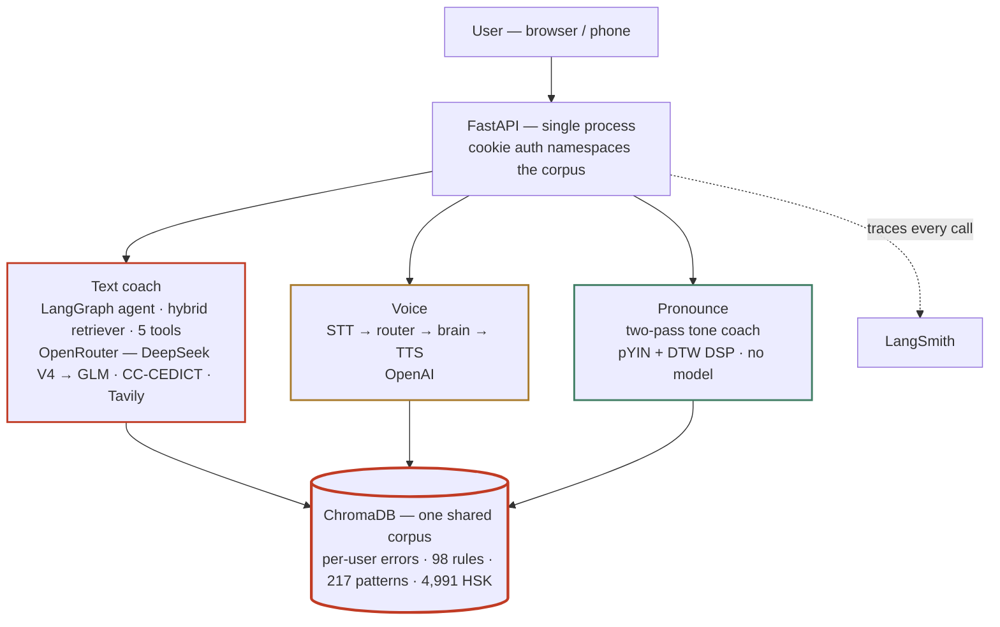

# Mandarin Coach

An AI coach for self-directed **intermediate** Mandarin learners (roughly HSK 2–4) — the
plateau where you can build sentences and hold a slow conversation, but keep repeating the
same handful of grammar, word-choice, and tone mistakes with nothing keeping a record.

Mandarin Coach corrects you as you practise **and remembers**: every correction is written
to a persistent, per-user error corpus, so the app can say *"you've made this exact mistake
nine times — let's drill it"* instead of treating you as an average learner on a fixed
curriculum.

**Live app:** https://34-129-227-111.nip.io

---

## Three coaches, one corpus

| Surface | What it does | Code |
|---|---|---|
| **Chat coach** | Text conversation with a grammar-aware agent. RAG over a grammar-rule corpus, CC-CEDICT dictionary + web-search tools, and inline correction. Extracts each error and logs it to your corpus. | `app/agent.py`, `app/tools.py`, `app/memory.py` |
| **Voice coach** | Free-form **spoken** conversation partner that speaks Mandarin — with an intent router that switches to an English **coaching** answer when you ask a learning question ("why was that wrong?"). STT → LLM → TTS. | `app/voice_api.py`, `app/agent.py` |
| **Practice** (pronunciation) | Two-pass tone coach: *compose & correct* a sentence, then *say & score* it. Pure-DSP pitch analysis (pYIN + DTW contour comparison) gives a per-syllable tone verdict and a curve overlay. | `app/pronounce_api.py`, `app/tone_analysis.py` |

All three feed the **same** per-user corpus (`app/memory.py`), so grammar errors from chat
and tone errors from pronunciation practice accumulate into one longitudinal picture of
what to drill next.

## Architecture

Three entry surfaces — text, voice, and pronunciation — all feed **one** per-user error corpus:


```mermaid
flowchart TD
  U["User — browser / phone"] --> F["FastAPI — single process<br/>cookie auth namespaces the corpus"]

  F --> T["Text coach<br/>LangGraph agent · hybrid retriever · 5 tools<br/>OpenRouter — DeepSeek V4 → GLM · CC-CEDICT · Tavily"]
  F --> V["Voice<br/>STT → router → brain → TTS<br/>OpenAI"]
  F --> P["Pronounce<br/>two-pass tone coach<br/>pYIN + DTW DSP · no model"]
  F -.->|traces every call| LS["LangSmith"]

  T --> DB[("ChromaDB — one shared corpus<br/>per-user errors · 98 rules · 217 patterns · 4,991 HSK")]
  V --> DB
  P --> DB

  classDef text stroke:#C13B24,stroke-width:2px;
  classDef voice stroke:#A87A2B,stroke-width:2px;
  classDef pron stroke:#3F7D63,stroke-width:2px;
  classDef corpus stroke:#C13B24,stroke-width:3px;
  class T text
  class V voice
  class P pron
  class DB corpus
```

- **Frontend** — hand-rolled single-page app (`app/web_ui/`: `index.html`, `app.js`,
  `practice.js`, `style.css`) served directly by FastAPI. No framework.
- **Server** — FastAPI (`app/server.py` boots `uvicorn app.server:app`); auth via a signed
  session cookie (`app/web_api.py`, `app/users.py`).
- **Agent** — LangGraph agent (`app/agent.py`) with grammar-rule RAG, dictionary, error-pattern,
  drill, and web-search tools.
- **Retrieval / memory** — ChromaDB vector store with **hybrid** BM25(jieba) + dense RRF
  retrieval over the grammar corpus, plus the persistent per-user error corpus (`app/memory.py`).
- **Models** — text reasoning + tools via **OpenRouter** (`app/config.py`); voice STT/chat/TTS
  direct on **OpenAI** (`gpt-4o-mini-transcribe` / `gpt-4o-mini` / `gpt-4o-mini-tts`) for latency.
- **Deploy** — always-on GCP VM running Docker + Caddy (automatic HTTPS); corpus on a
  persistent volume. See [`DEPLOY.md`](DEPLOY.md).

## Run locally

```bash
uv sync                       # install deps (see pyproject.toml)
uv run python data/load_data.py   # build the grammar / vocab ChromaDB corpus (first run)
uv run uvicorn app.server:app --reload
```

Set the required secrets in a `.env` (see `app/config.py` for the full list):

```
OPENROUTER_API_KEY=...     # text coach: reasoning models + tools
OPENAI_API_KEY=...         # voice: STT / chat / TTS
TAVILY_API_KEY=...         # web-search tool
CHAINLIT_AUTH_SECRET=...   # JWT signing secret for the session cookie (name is legacy)
```

## Repo layout

```
app/            the application (server, agent, tools, memory, voice + pronunciation APIs, web_ui/)
data/           reference corpora (grammar rules/patterns, HSK vocab, error patterns, CC-CEDICT) + loader
evals/          evaluation harness — surfaces, datasets, and results (see evals/README.md)
tests/          pytest suite
docs/           feature plans + the certification write-up (see below)
archive/        dead pre-pivot Chainlit UI, kept for reference only
Dockerfile · docker-compose.yml · Caddyfile · DEPLOY.md    deployment
```

## Docs

- **Feature plans** — [`docs/voice-coach-plan.md`](docs/voice-coach-plan.md),
  [`docs/pronunciation-coach-plan.md`](docs/pronunciation-coach-plan.md)
- **Evaluation harness** — [`evals/README.md`](evals/README.md)
- **Presentation** — a self-contained slide deck, live at
  **https://reubenfrith.github.io/mandarin-coach/** (source: [`docs/presentation.html`](docs/presentation.html) —
  open in any browser, arrow keys / scroll to advance, ⌘P to export a PDF), a
  matching speaker script ([`docs/presentation-script.md`](docs/presentation-script.md)),
  and a live-demo runsheet ([`docs/demo-runsheet.md`](docs/demo-runsheet.md)).

## Origins

This project began as an AI-engineering **certification challenge** and is now being extended
into a product. The original challenge write-up — problem framing, infrastructure and agent
diagrams, the full eval methodology and results, and the rubric traceability map — is
preserved in [`docs/certification/`](docs/certification/README.md).
